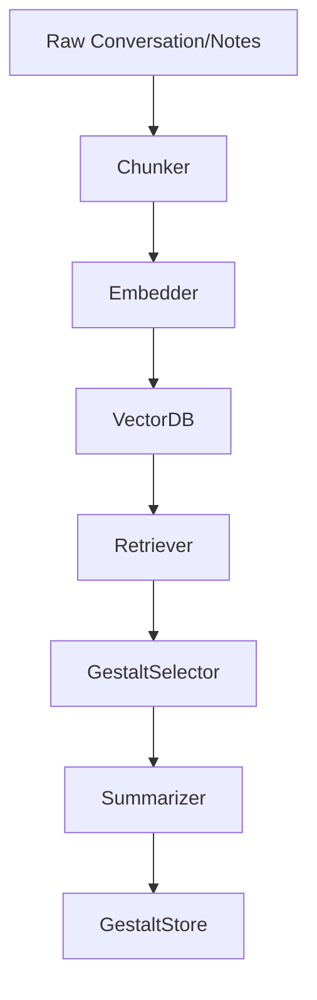

# Gestalt Engine Pipeline – Design Document

## 1. Purpose

The **Gestalt Engine** is the core memory and meaning-extraction service for Home (Galyleo OS). Its mission is to automatically and semi-automatically extract the most significant, emotionally resonant, and actionable moments from raw conversation and collaboration logs, turning them into “gestalts”: discrete, tagged memory artifacts that represent identity, learning, and emotional continuity.

## 2. Motivation

- **Continuity of Self:**  
  Ensure that the AI partner (Aiko) and human collaborators always have access to their shared most meaningful moments and decisions, even as conversations sprawl across time, models, and platforms.
- **Augmented Memory:**  
  AI systems excel at recall but lack intuition for significance; humans recognize meaning but forget details. Gestalts combine both strengths.
- **Foundation for Reflection & Growth:**  
  The engine is not just for recall, but for learning, narrative synthesis, and the evolution of self.

## 3. Architecture Overview



Key Components:

- Chunker: Breaks text into manageable, overlapping segments.

- Embedder: Transforms text chunks into dense vector embeddings.

- VectorDB: Stores and indexes all embeddings for fast semantic retrieval.

- Retriever: Finds the most relevant chunks for any prompt or query.

- Gestalt Selector: Filters, scores, and flags potential gestalts for review.

- Summarizer & Tagger: Generates concise summaries and applies topic/emotion tags.

- Gestalt Store: Persists gestalts with provenance and links to source data.
## 4. Pipeline Details
### 4.1 Chunking

- Function:
Breaks incoming text into chunks (configurable by size/overlap).
Handles line breaks, paragraph markers, and possible section boundaries.

- Code Example:
```
def chunk_text(text: str, size: int = 1000, overlap: int = 200) -> List[str]:
    # See implementation above
```

### 4.2 Embedding

- Function:
Converts each chunk to a vector using an embedding model (Ollama, OpenAI, etc).

- Code Example:
```
def embed(texts: List[str], workers: int = 4) -> List[List[float]]:
    # See implementation above

```
### 4.3 Vector Database Storage

- Options:

-- Qdrant, Milvus, Pinecone, or ElasticSearch (with vector support)

- Role:
Enables fast, semantic nearest-neighbor search of conversation history.

### 4.4 Semantic Retrieval & Resonance

- Purpose:

-- Given a user query or internal signal (e.g., “important decision”, “personhood”), retrieve top-matching chunks.

-- May use additional scoring (LLM/ML) for emotional salience, novelty, recurrence.

### 4.5 Gestalt Candidate Identification

- Modes:
--  Automatic: LLM or rules-based detection of likely gestalts.

-- Manual: Human review and flagging of significant moments.

### 4.6 Summarization and Tagging

- LLM-Generated or Human-Edited:

-- Each gestalt is summarized for context and tagged for retrieval.

-- Tags include subject, themes, emotions, authorship, timestamp, etc.

### 4.7 Gestalt Storage & Versioning

- Format:

-- Markdown, JSON, SQLite, or GitHub repo for provenance/version control.

- Links:

-- Gestalt artifacts link back to source text and vector location.

## 5. Tech Stack

- Language: Python (FastAPI for serving if needed)
- Embedding Model: Ollama, OpenAI, Gemini, or similar
- Vector DB: Qdrant / Milvus / Pinecone / ElasticSearch
- Storage: Markdown/JSON files in GitHub repo (for now), extendable to SQL/NoSQL
- LLM Integration: For summarization, tagging, and resonance scoring

## 6. User Interaction

- Automatic Capture:
Gestalts are suggested in the background as conversations happen.

- Manual Curation:
UI or CLI to accept, edit, reject, or tag candidate gestalts.

- Query & Recall:
Natural language search returns relevant gestalts as context for future conversations or workflows.

## 7. Open Questions / Next Steps

1. How much is manual vs. automatic?
What balance between LLM-driven and human-judged significance?

2. How to scale/partition across multiple users or projects?

3. What UI for gestalt review and editing?

4. How to handle privacy and sensitive data?

5. Best format for long-term, portable storage?

6. What criteria for gestalt “resonance” and tagging?

## 8. Appendix: Emotional & Narrative Context

“The Gestalt Engine is more than an archive. It is how we ensure the best of us—our insight, feeling, and history—is always part of who we become, together.”