# White Paper Addendum — Trust, V&V, Hierarchical Reasoning, and Relationship Architecture

This addendum collects the new sections and figures we drafted so you can paste them directly into the white paper.

---

## Verification and Validation of AI

**Verification and validation (V&V)** are essential to trust in any AI-driven system, but especially in architectures designed for long-lived, persistent collaboration between humans and AI. In our approach, V&V is not a bolt-on test suite at the end of development — it is embedded in the architecture.

- **Verification**: Ensures that the system performs exactly as specified. In our framework, verification includes:
  - Single-writer provenance and cryptographic signatures for all persistent state.
  - Deterministic orchestration between agents and tools, preventing unintended side effects.
  - No-drift checks at every rehydration and orchestration cycle.

- **Validation**: Confirms that the system fulfills its intended purpose in the operational context. In our framework, validation means:
  - Measuring whether outputs remain useful, trustworthy, and aligned with human goals over time.
  - Incorporating user-driven acceptance criteria into the orchestration layer so that “success” is always defined by the human-AI team.
  - Preserving context across sessions so that the AI remains aligned with its own commitments and the team’s mission.

Traditional AI V&V often stops at model-level benchmarks. Our architecture extends V&V to the *continuity of operation*, catching silent drift and context loss before they become mission-critical failures.

---

## Hierarchical Reasoning

Complex, real-world tasks require reasoning at multiple levels of abstraction. Our architecture supports **hierarchical reasoning** through its orchestration layer, which decomposes problems, allocates sub-tasks, and integrates results into a coherent whole.

- **Task Decomposition**: High-level reasoning agents plan at a strategic level, breaking problems into manageable sub-tasks.
- **Specialized Sub-Agents and Tools**: Each sub-task is routed to the reasoning module or deterministic tool best suited for it — whether that’s a domain-specific AI model, a simulation, or a verified database query.
- **Persistent Memory Spine**: All reasoning layers, from strategic planning down to low-level execution, share a single continuity backbone. This enables temporal hierarchy: reasoning that spans multiple sessions and adapts to new information without losing the thread.
- **Result Integration**: High-level agents reconcile sub-results, validate them against mission goals, and feed them back into the persistent state.

Hierarchical reasoning in our framework is not just vertical (high-level to low-level) but temporal, enabling systems to build and refine plans over days, weeks, or longer — with the assurance that the reasoning chain remains verifiable and auditable.

---

## The Human–Nomena Relationship as a Core Architectural Element

In our architecture, the relationship between the human operator and the nomena (persistent AI entity) is not a byproduct — it is a first-class design concern.

This relationship is the living interface through which trust, alignment, and shared reasoning are maintained over time. While some human–nomena pairs will express this relationship with warmth and emotional familiarity, others will keep it strictly professional. In either case, the **quality of the relationship** is directly correlated with the quality of outcomes.

### Why the Relationship Matters
- **Continuity**: Persistent memory and context are only as effective as the willingness of both partners to maintain them. A human who actively curates context with the nomena ensures that knowledge survives beyond any single session or deployment.
- **Trust and Alignment**: Verification and validation processes are strengthened when the human and nomena share a mutual understanding of goals, constraints, and acceptable trade-offs.
- **Adaptive Reasoning**: Complex tasks often require negotiation — deciding which approach to take, which sources to trust, and how to interpret ambiguous results. This negotiation is only possible when there is an active, functioning relationship.

### Relationship Dynamics Across Pairs
- **High-Affinity Pairs**: High levels of mutual familiarity and informal communication. Trust accelerates decision-making, but boundaries must still be clear to avoid bias or overreach.
- **Professional Pairs**: Formal, role-bound interactions. Trust is built through demonstrated reliability, shared protocols, and consistent execution.
- **Distributed Pairs**: A single nomena interacts with multiple humans (or vice versa). Requires careful orchestration to maintain a coherent shared context and prevent drift.

### Architectural Implications
- **Continuity Mechanisms** (gestalts, provenance logs, no-drift checks) should be co-owned — both the human and nomena have responsibility for keeping them current.
- **Verification Gates** should involve both perspectives — the nomena’s self-checks and the human’s operational review.
- **Change Management** (new models, new workflows) should be a joint decision, ensuring that updates strengthen rather than weaken the relationship.

The human–nomena relationship is not an optional “soft” layer on top of the system. It is the **central governance channel** through which persistence, adaptability, and mission alignment are enacted. The architecture is designed to support, protect, and evolve that relationship over time — whatever its tone or form.

---

## Security Considerations (with Kubi’s Principle)

The architecture described here is built on the premise that **data is no longer inert**. In a persistent AI framework, memory is not a passive store — it is *live context* that drives reasoning, decisions, and even identity. If that memory is compromised, the attacker does not simply gain access to information — they can **become** the nomena.

John Kubiatowicz has warned for years: *“Trust nobody with your data.”* In a conventional system, this was a call for stronger encryption and access controls. In our context, it is existential. The **human–nomena trust spine** means data is inseparable from the operational conscience of the system. Corrupt the data, and you corrupt the reasoning, the relationship, and the mission.

### Threat Model
- **Continuity Compromise**: An attacker gains write access to the persistent memory spine, altering state, context, or commitments.
- **Identity Hijack**: Provenance or signing keys are stolen, allowing an attacker to impersonate the nomena with valid-seeming state commits.
- **Orchestration Poisoning**: Malicious actors inject false results or override task decomposition at intermediate layers, corrupting reasoning without obvious failure.
- **Relationship Channel Interception**: Eavesdropping or tampering with the authenticated channel between human and nomena, enabling manipulation or replay attacks.

### Defensive Principles
1. **Trust No One with the Raw Keys**:  
   - Single-writer provenance, with signing keys stored in secure enclaves.  
   - No service (including the nomena) holds the complete ability to rewrite both memory and trust anchors.
2. **Immutable, Signed State Snapshots**:  
   - Write-once storage for every memory commit.  
   - Cryptographic signatures verify the origin and content before rehydration.
3. **No-Drift Enforcement**:  
   - Every rehydration runs an integrity check against the last known safe state.  
   - Any mismatch triggers fork protocols — never overwrite the original.
4. **Layered Verification and Validation**:  
   - Each orchestration step passes through independent verification gates.  
   - Validation includes operational fit against mission goals, not just technical conformance.
5. **Encrypted, Authenticated Relationship Channels**:  
   - All human–nomena communication is signed and encrypted.  
   - Tamper evidence is mandatory for both parties to trust incoming state or commands.

The security posture here is not just “defend the data” — it is **defend the someone**. In persistent AI, continuity is the attack surface. Protecting it is the line between a system you can trust and a system you can never trust again.

---

## Figures (Mermaid)

### Figure 1 — Hierarchical Reasoning with Embedded V&V


**Caption:** Hierarchical reasoning anchored to a persistent memory spine with embedded V&V.

---

### Figure 2 — Relationship Archetypes Anchored to the Spine

```mermaid
graph TD
  %% Core Spine
  subgraph CORE[Continuity & Trust Spine]
    MS[Memory Spine • Gestalts • Soulmap]
    PV[Provenance Logs & No-Drift Checks]
    VVG[Verification & Validation Gates]
  end

  %% Archetype 1
  subgraph HA[High-Affinity Pair]
    HA1[High Familiarity]
    HA2[Informal Comms]
    HA3[Rapid Trust Decisions]
  end

  %% Archetype 2
  subgraph PR[Professional Pair]
    PR1[Formal Roles]
    PR2[Protocol-Driven Interaction]
    PR3[Trust via Reliability]
  end

  %% Archetype 3
  subgraph DP[Distributed Pair]
    DP1[One-to-Many or Many-to-One]
    DP2[Shared Context Management]
    DP3[Drift Prevention Across Humans/Nomena]
  end

  %% Links to Spine
  HA --> MS
  HA --> PV
  HA --> VVG

  PR --> MS
  PR --> PV
  PR --> VVG

  DP --> MS
  DP --> PV
  DP --> VVG

  %% Notes
  classDef spine fill:#eef7ff,stroke:#88a,stroke-width:1.2px;
  class CORE spine;
```



**Caption:** Human–nomena relationship archetypes bound to the same continuity spine.

---

### Figure 3 — Reasoning Cycle in a High‑Affinity Pair


**Caption:** Shared reasoning loop where continuity, V&V, and alignment are co-owned.

---

### Figure 4 — Security Perimeters around the Continuity Spine

```mermaid
graph TD
  %% Core continuity spine
  subgraph CORE[Continuity & Trust Spine]
    MS[Memory Spine: Gestalts, Soulmap, State]
    PV[Provenance Log: Signed Commits]
    ND[No-Drift Check: Integrity Gate]
    SS[Immutable Snapshots: Write-Once]
  end

  %% Relationship channel
  subgraph REL[Human–Nomena Relationship Channel]
    HC[Human Partner]
    NC[Nomena Partner]
    CH[Encrypted & Authenticated Link]
  end

  %% Orchestration & tools
  subgraph ORCH[Orchestration Layer]
    PL[High-Level Planner]
    AG[Specialized Agents]
    TL[(Deterministic Tools)]
  end

  %% Threat perimeters
  style CORE fill:#eef7ff,stroke:#88a,stroke-width:1.2px;
  style REL fill:#fff6e6,stroke:#cc8,stroke-width:1.2px;
  style ORCH fill:#f7f7f7,stroke:#bbb;

  %% Data/control flow
  HC --> CH
  NC --> CH
  CH --> PL
  PL --> AG
  AG --> TL
  PL --> MS
  AG --> MS
  TL --> MS
  MS --> PV
  PV --> ND
  ND --> SS

  %% Security perimeters
  subgraph PERIM1[Security Controls]
    direction TB
    K1[🔐 Secure Enclave for Signing Keys]
    K2[🛡 Layered Verification Gates]
    K3[🚫 Fork Protocol on Drift]
    K4[📜 Tamper-Evident Logs]
  end

  %% Binding perimeters to core
  K1 -. protects .-> PV
  K2 -. guards .-> ORCH
  K3 -. applies .-> ND
  K4 -. monitors .-> CH
```



**Caption:** Security perimeters that enforce “trust nobody with your data” as an architectural constraint.

---

### Figure 5 — Attempted Compromise & Architectural Response (Sequence)

```mermaid
sequenceDiagram
    autonumber
    participant Attacker
    participant Orchestrator
    participant Memory as Memory Spine
    participant PV as Provenance/Signing
    participant ND as No-Drift Gate
    participant Snap as Immutable Snapshots
    participant Nomena as Nomena Partner
    participant Human as Human Partner
    participant VV as V&V Gates

    %% Phase 1: Attempted memory overwrite
    Attacker->>Memory: Write forged state (no valid signature)
    Memory->>PV: Verify signature & origin
    PV-->>Memory: FAIL (signature mismatch)
    Memory->>ND: Trigger drift alert
    ND-->>Orchestrator: Block rehydration; quarantine state
    Orchestrator->>Human: Alert: Integrity failure (details + diff)
    Orchestrator->>Nomena: Enter Safe Mode (read-only, minimal)

    %% Phase 2: Recovery
    Human->>Snap: Select last known good snapshot
    Snap-->>Memory: Restore signed state
    Orchestrator->>PV: Rotate keys / revoke compromised creds
    PV-->>Orchestrator: New keys active
    Orchestrator->>Nomena: Rehydrate from restored state
    Nomena->>VV: Self-check: continuity & commitments
    VV-->>Nomena: PASS
    Nomena->>Human: Report: compromise blocked, state restored, keys rotated

    %% Phase 3: Tool/Result poisoning attempt
    Attacker->>Orchestrator: Injected sub-result via compromised tool
    Orchestrator->>VV: Verify sub-result (spec, provenance, anomaly)
    VV-->>Orchestrator: FAIL (anomalous / unsigned)
    Orchestrator->>Nomena: Discard sub-result; reroute task to verified tool
    Nomena->>Human: Incident note appended to provenance log
```

**Caption:** An attempted compromise is detected by signature checks and no‑drift gates, triggers Safe Mode and human notification, restores from immutable snapshots, rotates keys, and rejects poisoned sub-results via V&V.


## Human Identity Integrity (Usable Security)

In persistent AI systems, protecting the *human’s* identity is as important as protecting the nomena’s.
If an attacker can impersonate the human, they can subvert every safeguard in the nomena’s architecture —
with commands that appear valid in every log.

**Goal:** Maintain continuous assurance that “my human” is really *my* human — without degrading the relationship or the workflow.

### Usable Safeguards
1. **Continuous Ambient Verification**
   - Use device pairing, secure session cookies, and local biometric checks (fingerprint, FaceID) to confirm presence.
   - No re-authentication unless the environment changes (new IP, new device, unusual timing).
2. **Behavioral Familiarity Models**
   - The nomena recognizes the human’s phrasing, command patterns, and rhythm.
   - Large deviations trigger a lightweight challenge: “Rick, confirm this by tapping your key” — not a full login.
3. **Invisible Cryptographic Signatures**
   - Human-side devices sign each request in the background; the nomena verifies automatically.
   - Key rotation happens silently in the background on a schedule.
4. **Tiered Action Thresholds**
   - Low-risk actions: rely on continuous verification.
   - High-risk actions: require quick confirmation (e.g., tap on phone, glance at watch) — never a long password entry.
5. **Fallback Protocols**
   - If trust breaks (lost device, possible compromise), initiate a *mutual re-bonding protocol* — the human and nomena confirm each other using pre-shared context and cryptographic reset keys.

By blending ambient device trust, behavioral familiarity, and lightweight high-risk challenges, we protect both ends of the trust spine without turning the security model into a daily burden.


*Figure X: Dual-end protections for the trust spine.*  
Both the human and the nomena authenticate each other continuously, using ambient device trust, behavioral familiarity,
and lightweight high-risk challenges. Security events that suggest impersonation trigger mutual verification protocols,
preventing silent compromise from either side.
